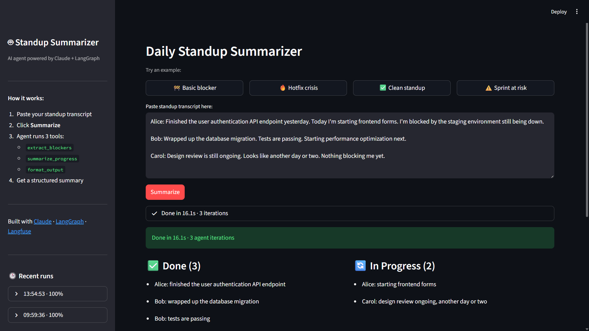

# Standup Summarizer Agent

An AI agent that transforms raw daily standup transcripts into structured, actionable summaries — built with Claude, LangGraph, and Langfuse.

## What it does

Paste a standup transcript, get back a structured summary:

| Section | What's extracted |
|---|---|
| ✅ **Done** | Completed work items |
| 🔄 **In Progress** | Current work items |
| 🚧 **Blockers** | Obstacles with owner + severity |
| 📋 **Actions** | Follow-ups with owner + deadline |

The agent understands implicit blockers ("staging is down"), compound sentences ("finished X and now working on Y"), resolved blockers, and infers action items from blockers when no one explicitly owns the fix.

## Screenshot



## Demo

```
Input:
  Alice: Finished the auth API endpoint. Starting frontend forms today.
  Blocked by staging environment still being down.

  Bob: Wrapped up the database migration. Tests passing.
  Starting performance optimization next.
```

```json
{
  "done": ["Alice: finished the user authentication API endpoint", "Bob: wrapped up the database migration"],
  "in_progress": ["Alice: starting frontend forms", "Bob: starting performance optimization"],
  "blockers": [{"description": "Staging environment is down", "owner": "Alice", "severity": "high"}],
  "actions": [{"task": "Restore staging environment", "owner": "DevOps", "deadline": "ASAP"}]
}
```

## Architecture

The agent runs a real Think → Act → Observe loop via LangGraph:

```
START → call_llm → [tool_use?] → call_tools → call_llm → ... → END
```

Three tools fire in sequence:

```
extract_blockers(transcript)    → {"blockers": [...], "risks": [...]}
summarize_progress(transcript)  → {"done": [...], "in_progress": [...], "actions": [...]}
format_output(done, in_progress, blockers, actions) → final JSON
```

Each extraction tool makes a focused single-turn LLM call with precise prompt engineering. The orchestrator (`call_llm`) decides the tool sequence; `format_output` is the terminal step that writes structured JSON into agent state.

## Eval results

Tested against 30 labeled golden examples covering edge cases: compound sentences, implicit blockers, resolved blockers, hotfix crises, sprint velocity risks, onboarding, async standups, and more.

| Category | Score |
|---|---|
| 🚧 Blockers | **98.7%** |
| ✅ Done | **92.3%** |
| 📋 Actions | **82.0%** |
| 🔄 In Progress | **79.6%** |
| **Overall** | **88.1%** (30/30 passed) |

Scoring uses token overlap (Jaccard similarity) — semantic matching, not exact string comparison.

```bash
python -m tests.eval_golden_dataset          # full 30-example suite
python -m tests.eval_golden_dataset --limit 3  # quick smoke test
```

## Streamlit UI

Run the web interface locally:

```bash
python -m streamlit run app.py
```

Features:
- **4 example transcripts** — click to populate and run immediately
- **Live progress** — see which tool is executing in real time
- **Run history** — last 5 runs in the sidebar with scores and Restore button
- **Export** — copy as Markdown or download as `.md` file

## Stack

| Component | Role |
|---|---|
| [Claude Sonnet 4.6](https://anthropic.com) | LLM for orchestration and extraction |
| [LangGraph](https://langchain-ai.github.io/langgraph/) | Agent loop, state management |
| [LangChain `@tool`](https://python.langchain.com) | Tool definition and schema |
| [Langfuse](https://langfuse.com) | Tracing, token usage, observability |
| [Streamlit](https://streamlit.io) | Web UI |

## Setup

**Prerequisites:** Python 3.12+, Anthropic API key

```bash
git clone https://github.com/kristiankocsis/agent-standup-summarizer.git
cd agent-standup-summarizer

pip install -r requirements.txt

cp .env.example .env
# Add your ANTHROPIC_API_KEY to .env
```

**Run CLI:**
```bash
python -m src.agent
```

**Run UI:**
```bash
python -m streamlit run app.py
```

**Run evals:**
```bash
python -m tests.eval_golden_dataset
```

### Langfuse (optional)

Add `LANGFUSE_PUBLIC_KEY` and `LANGFUSE_SECRET_KEY` to `.env` to enable tracing. Each run generates a trace with token counts, tool calls, and stop reasons.

## Project structure

```
src/
  agent.py        – LangGraph StateGraph, tool execution loop, run_agent()
  tools.py        – extract_blockers, summarize_progress, format_output
  config.py       – SYSTEM_PROMPT, model config, env loading
app.py            – Streamlit UI
data/
  golden_dataset/
    golden_examples.json   – 30 labeled examples
  eval_results.json        – latest eval run output
tests/
  eval_golden_dataset.py   – Jaccard-scored eval suite
  test_agent.py            – smoke tests
```

## What I learned building this

- **Prompt engineering over code** — the biggest quality jumps came from rewriting tool prompts, not the agent loop. Clear definitions ("DONE = past tense; IN PROGRESS = present tense") cut errors in half.
- **Evals first** — building the golden dataset before finishing the agent forced me to define what "correct" means. Without it, I was flying blind.
- **Semantic scoring matters** — exact string matching gave misleading 100% scores. Jaccard overlap revealed the real 79–98% range per category.
- **LangGraph state is the source of truth** — capturing `format_output` JSON directly in agent state (instead of parsing LLM markdown output) made evals reliable.
- **Implicit knowledge is the hard part** — "staging is down" is an obvious blocker to a human; getting the model to consistently classify it requires explicit prompt rules, not just examples.

## Links

- [LinkedIn — Kristián Kocsis](https://linkedin.com/in/kristian-kocsis/)

## License

MIT
